# Додаткове завдання.  Робота з системою контролю версій Git

<strong>Група:</strong> ІО-42

<strong>Виконав:</strong> Куліков М. М.  
<strong>Номер в списку:</strong> 4209  
<strong>Перевірив:</strong> Каплунов А. В.

## **Тема:** 
Робота з системою контролю версій Git

## **Хід роботи:**
Почнемо з клонування репозиторію. Спочатку обираємо каталог, в який ми будемо його клонувати. Для цього в PowerShell (або bash) прописується команда «cd \<шлях\>», а для клонування – «git clone https://github.com/SergiiPiatakov/calculator.git».

  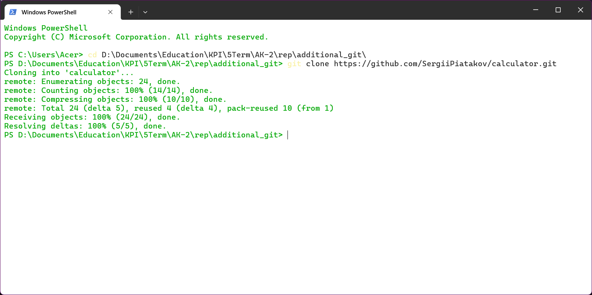 
  <i>Рисунок 1 – Результат копіювання репозиторію «Calculator.git»</i>

Переходимо в папку проєкту, використавши раніше згадану команду «cd .\calculator\». Переглянемо існуючі коміти, аби розуміти які саме ми будемо переміщати один з одним. Аби побачити історію комітів, прописується команда «git log --oneline». Результат її виконання представлений на рисунку 2.

  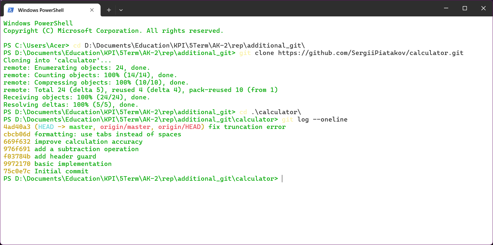 
  <i>Рисунок 2 – Результат виведення історії комітів проєкту «Calculator.git»</i>

Використовуючи «git rebase -i HEAD~5», змінимо місцями коміти: «fix truncation error» та «formatting: use tabs instead of spaces». Оскільки у моєму випадку, у налаштуваннях Git встановлено відкриття файлів через «Блокнот», то усі наступні редагування відбуватимуться саме там. Хід дій показано на рисунках 3, 4 та 5.

  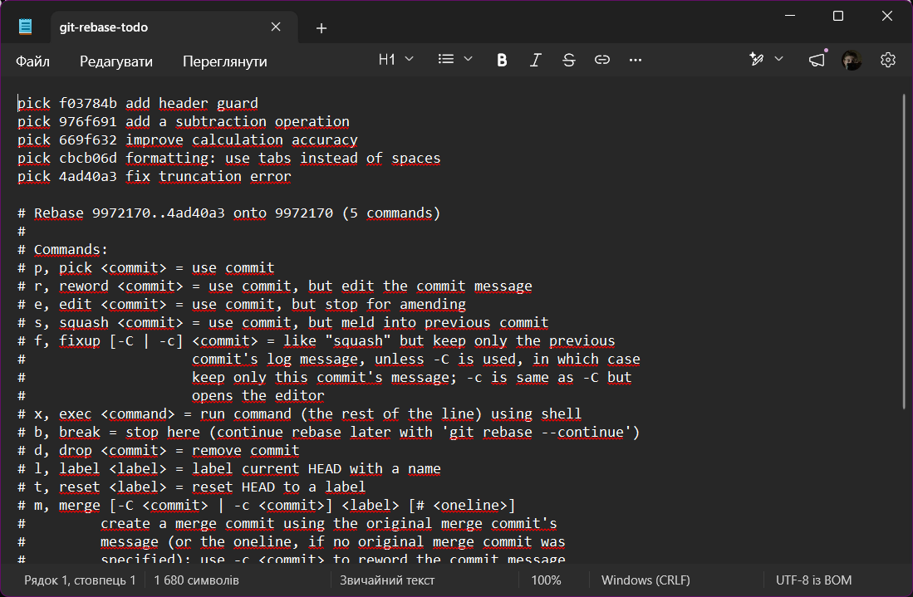 
  <i>Рисунок 3 – Скриншот вмісту файлу «git-rebase-todo» до редагування</i>

  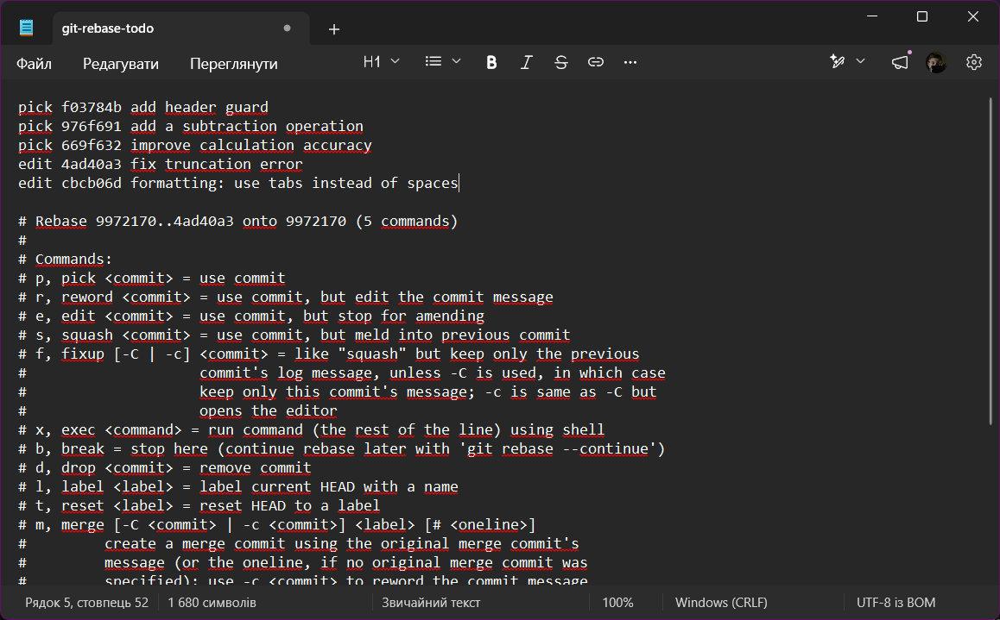 
  <i>Рисунок 4 – Скриншот вмісту файлу «git-rebase-todo» після редагування</i>

  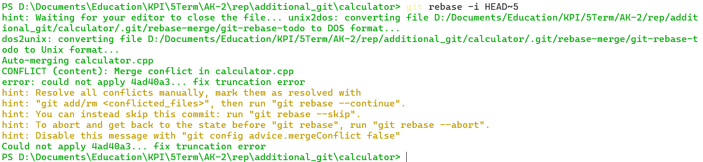 
  <i>Рисунок 5 – Результат виконання команди «git rebase -i HEAD~5» у PowerShell</i>

Оскільки утворились конфлікти, то будемо вносити певні зміни в файли за допомогою «Блокнота», а потім виправимо помилки за допомогою команд «git add .», «git commit --amend --signoff --no-edit» і «git rebase --continue».

  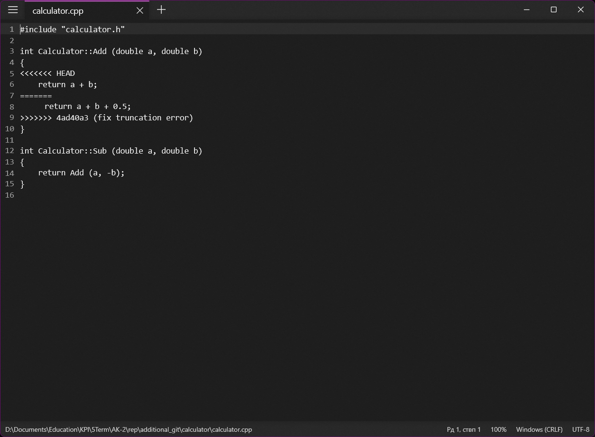 
  <i>Рисунок 6 – Файл «calculator.cpp» до внесення змін</i>

  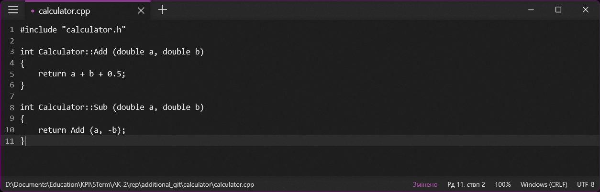 
  <i>Рисунок 7 – Файл «calculator.cpp» після внесення змін</i>

  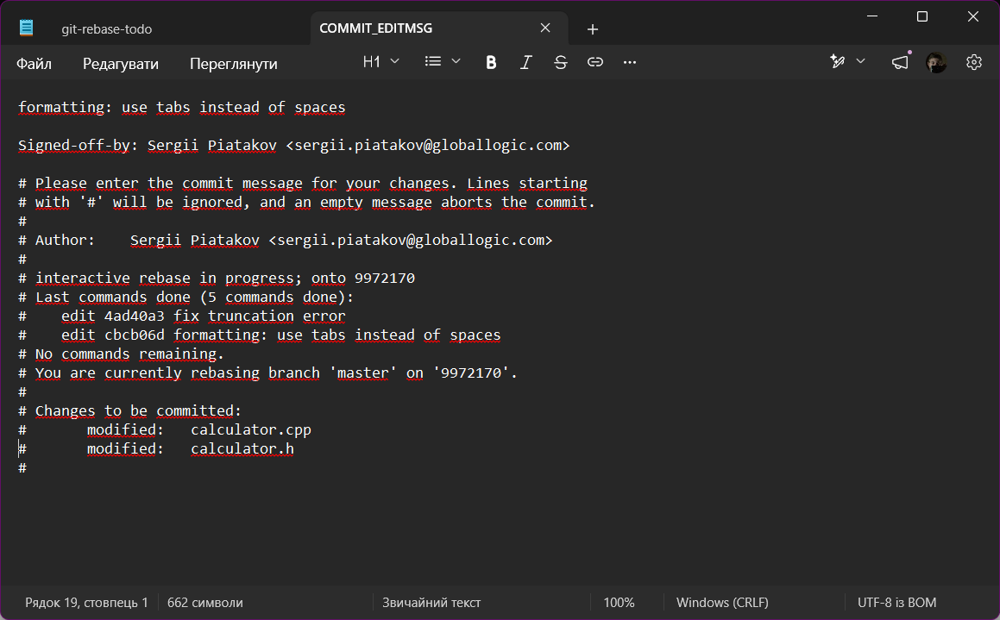 
  <i>Рисунок 8 – Введення назви коміта</i>

  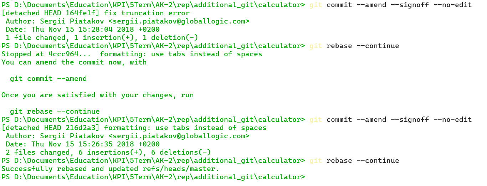 
  <i>Рисунок 9 – Результати виконання команд «git add .», «git commit --amend --signoff» і «git rebase --continue»</i>

У результаті виконання команди «git commit --amend --signoff» до комітів додались підписи. Їх можна побачити на рисунку 10.

  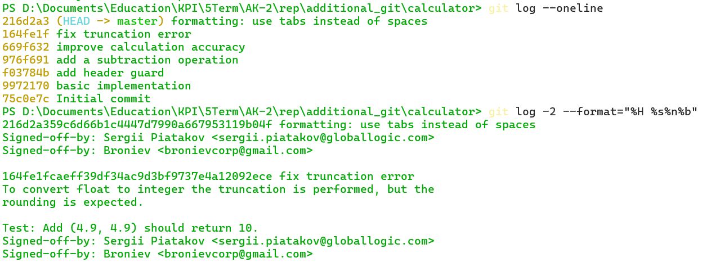 
  <i>Рисунок 10 – Вигляд коміта з підписом</i>

Створимо два патчі командою «git format-patch -2 -o patches». Вони будуть утворені у відповідній папці «patches».

  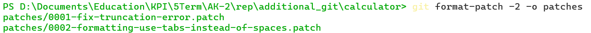 
  <i>Рисунок 11 – Результат виконання команди «git format-patch -2 -o patches»</i>

Тепер поєднаємо «improve calculation accuracy» та «fix truncation error» в один коміт, використовуючи «git rebase -i».

  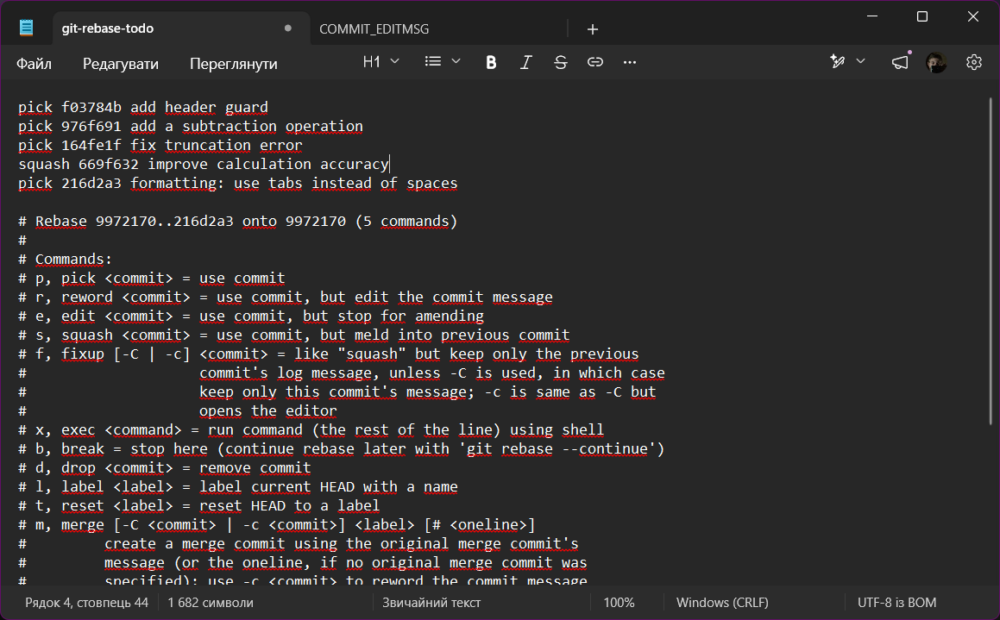 
  <i>Рисунок 12 – Редагування у інтерактивному rebase редакторі</i>

  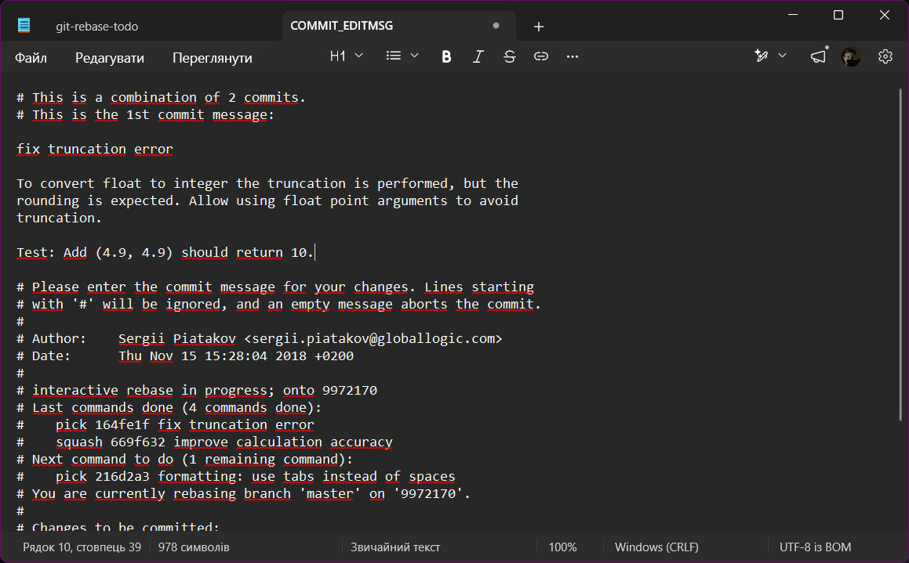 
  <i>Рисунок 13 – Вікно введення назви коміту</i>

  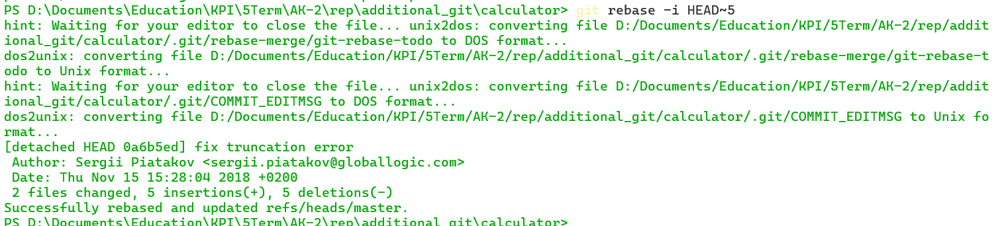 
  <i>Рисунок 14 – Результат виконання поєднання двох комітів</i>

Перевіримо, чи дійсно два коміта з'єднались. Для цього перевіримо історію комітів.

  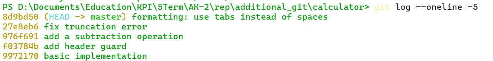 
  <i>Рисунок 15 – Результат виконання команди «git log --oneline»</i>

Тепер видалимо верхній коміт. Для цього використовуємо команду «git rebase -i HEAD~5» і ключове слово «pick» замінюємо на «drop».

  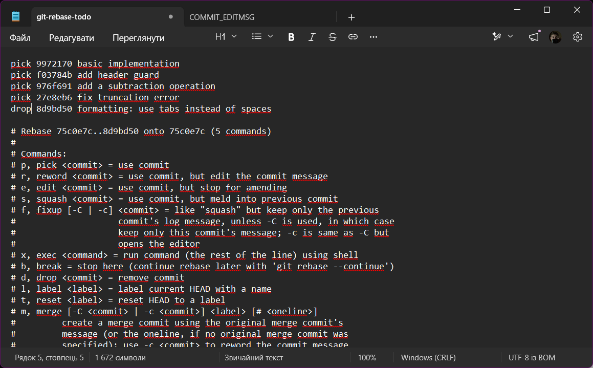 
  <i>Рисунок 16 – Редагування у інтерактивному rebase редакторі</i>

  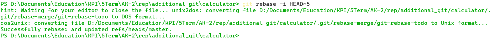 
  <i>Рисунок 17 – Результат команди «git rebase -i HEAD~5»</i>

Переглянемо історію комітів, аби упевнитись що коміт видалено.

  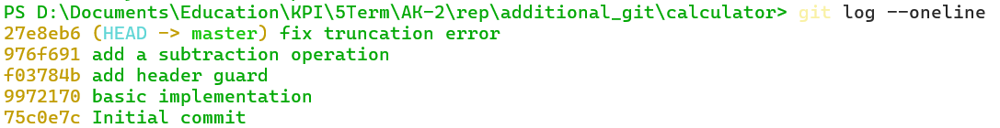 
  <i>Рисунок 18 – Результат команди «git log --oneline»</i>

Перейменуємо поточне сховище на «github». Для цього виконаємо команду «git remote rename origin github». Також додамо ще одне віддалене сховище: https://gitlab.com/SergiiPiatakov/calculator.git і назвемо його «gitlab». Це зробимо командою «git remote add gitlab https://gitlab.com/SergiiPiatakov/calculator.git».

  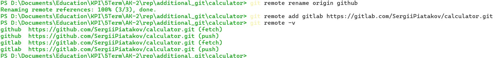 
  <i>Рисунок 19 – Результат виконання команд для перейменування та додавання іншого репозиторію</i>

Отримаємо код з віддаленого сховища «gitlab» за допомогою команди «git fetch gitlab».

  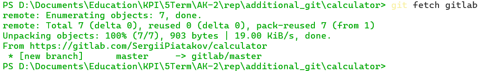 
  <i>Рисунок 20 – Отримання коду з віддаленого сховища за допомогою команди «git fetch gitlab»</i>

А також дослідимо його за допомогою команди «git log gitlab/master --oneline --graph».

  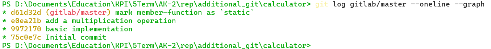 
  <i>Рисунок 21 – Результат виконання команди «git log gitlab/master --oneline --graph»</i>

Додамо коміт за допомогою команди «git cherry-pick \<хешкод\>». У нашому випадку хеш код e0ea21b.

  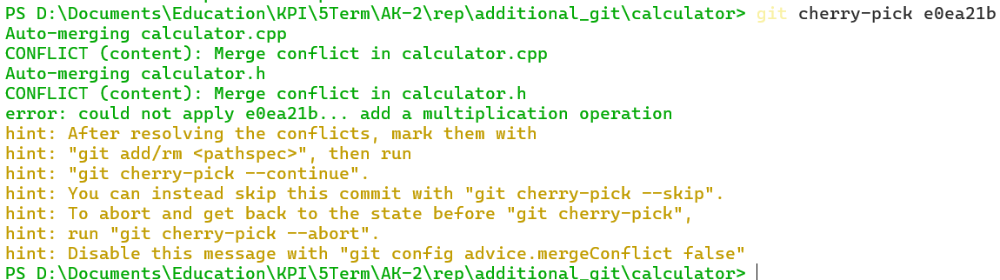 
  <i>Рисунок 22 – Результат виконання роботи команди «git cherry-pick \<хешкод\>»</i>

Виник конфлікт, який треба усунути. Для цього змінимо файл «calculator.cpp». Після цього виконаємо «git add calculator.cpp» і «git cherry-pick --continue».

  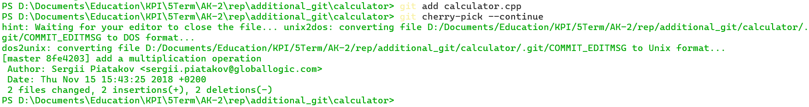 
  <i>Рисунок 23 – Результат виконання роботи команди «git cherry-pick \<хешкод\>»</i>

Додамо пару рядків у файли «calculator.cpp» та «calculator.h».

  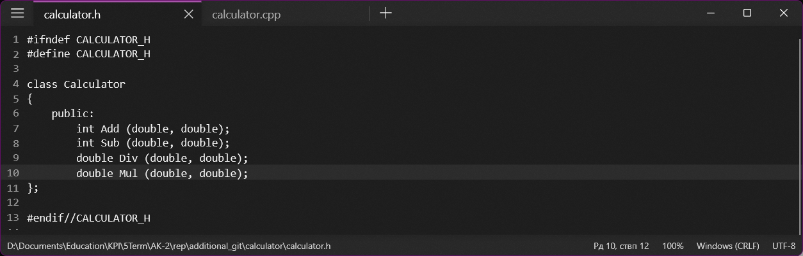 
  <i>Рисунок 24 – Редагований файл «calculator.h»</i>

  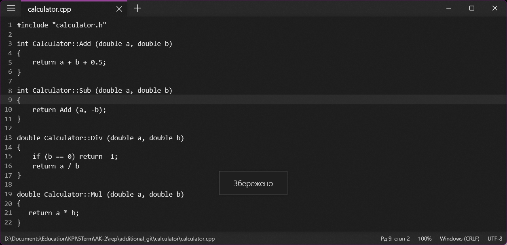 
  <i>Рисунок 25 – Редагований файл «calculator.cpp»</i>

Виконаємо команди «git add .» і «git commit -m "added Div and Sub"». Далі створюємо віддалений репозиторій на сайті GitHub. Оскільки репозиторій вже створено раніше, то ми створимо окрему гілку, де буде розміщено саме це завдання. Для цього вводимо команду «git remote add ak2 https://github.com/BronievM/KPI-AK2.git» і відправляємо зміни командою «git push -u ak2 master:lab-git».

  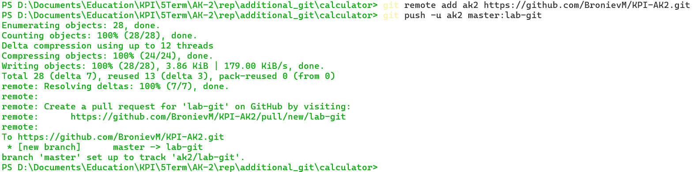 
  <i>Рисунок 26 – Результат підключення до віддаленого репозиторія</i>

І у результаті на сайті https://github.com/BronievM/KPI-AK2/commits/lab-git/ можемо побачити усі створені коміти.

  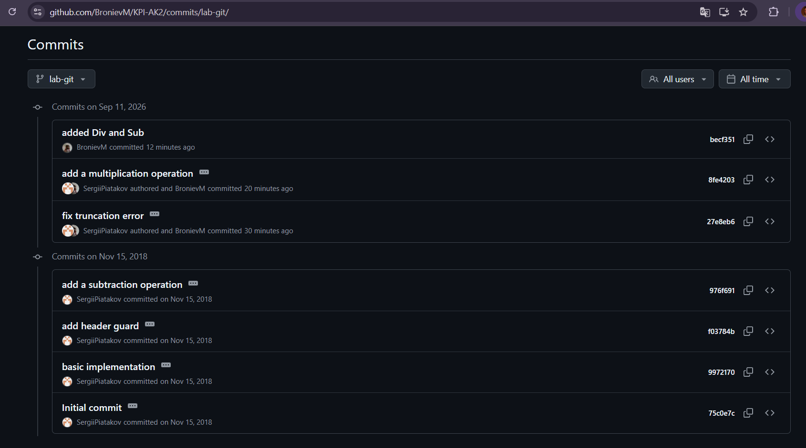 
  <i>Рисунок 27 – Вміст сторінки «https://github.com/BronievM/KPI-AK2/commits/lab-git/»</i>

# Висновки 
Отже, у результаті виконання роботи було створено репозиторій на GitHub, а також засвоєно основні команди для роботи з системою керування версіями Git. Зокрема, було вивчено, як клонувати репозиторій, переглядати історію комітів, змінювати їхній порядок та об'єднувати за допомогою інтерактивного rebase, створювати патчі, працювати з кількома віддаленими репозиторіями, отримувати зміни командою fetch, переносити окремі коміти за допомогою cherry-pick з вирішенням конфліктів, а також публікувати результати роботи у власній гілці на GitHub.
