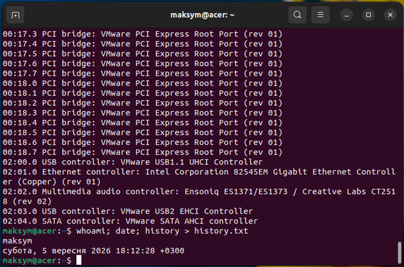
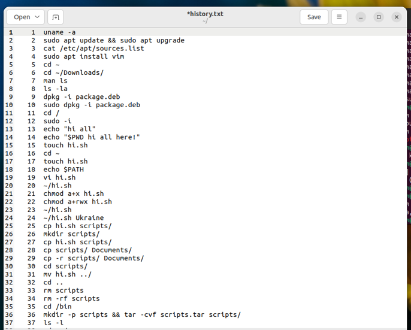
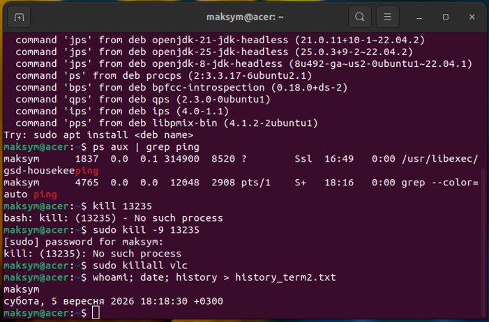
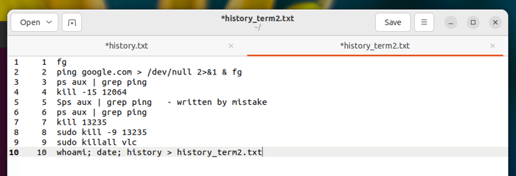
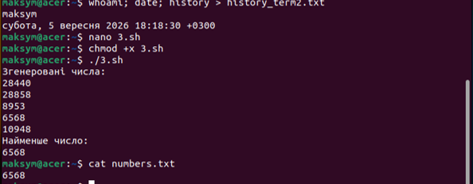

# Лабораторна робота №1

<div align="right">
<strong>Група:</strong> ІО-42

<strong>Виконав:</strong> Куліков М. М.  
<strong>Номер в списку:</strong> 4209  
<strong>Перевірив:</strong> Каплунов А. В.
</div>

## **Тема:** 
Базові основи використання ОС Linux та інструментів для автоматизації збірки та розробки програмно-апаратного забезпечення

## **Мета:** 
Вивчення базових принципів роботи з операційною системою Linux. Отримання навичок використання командного рядка, файлової системи, системних утиліт та засобів керування процесами. Вивчення основ автоматизації задач за допомогою Bash-скриптів. Розроблення та виконання Bash-скрипта для автоматизації обробки даних.

## **Хід роботи:**
### Завдання 1.1

<p align="center">
  <br>
  <i>Рисунок 1 – Результат виконання команд для першого терміналу</i>
</p>


<p align="center">
  <br>
  <i>Рисунок 2 – Вміст файлу history.txt</i>
</p>


<p align="center">
  <br>
  <i>Рисунок 3 – Результат виконання команд для другого терміналу</i>
</p>


<p align="center">
  <br>
  <i>Рисунок 4 – Вміст файлу history_term2.txt</i>
</p>

### Завдання 1.2
Номер залікової книжки – 4209. Тоді: 4209 mod 6 = 3. Отже треба розробити  Bash-скрипт, який виконає наступне завдання: Сгенерувати та записати до файлу 5 випадкових додатних чисел. Вивести їх на екран. Видалити з файлу всі числа крім найменшого. Результат вивести на екран.

Код  Bash-скрипта: 
```bash
#!/bin/bash

FILE="numbers.txt"

# Генеруємо 5 випадкових додатних чисел
for i in {1..5}; do
    echo $((RANDOM + 1))
done > "$FILE"

# Виводимо згенеровані числа
echo "Згенеровані числа:"
cat "$FILE"

# Знаходимо найменше число
MIN=$(sort -n "$FILE" | head -n 1)

# Залишаємо у файлі тільки найменше число
echo "$MIN" > "$FILE"

# Виводимо результат
echo "Найменше число:"
cat "$FILE"
```

<p align="center">
  <br>
  <i>Рисунок 5 – Результат виконання скрипта</i>
</p>

# Висновки 
Отже, під час виконання лабораторної роботи було опановано основи роботи з операційною системою Linux та командним рядком. Було отримано навички роботи з файлами, каталогами, процесами та системними командами. Також було розглянуто основи автоматизації задач за допомогою Bash-скриптів та створено скрипт для генерації випадкових чисел і визначення найменшого з них.